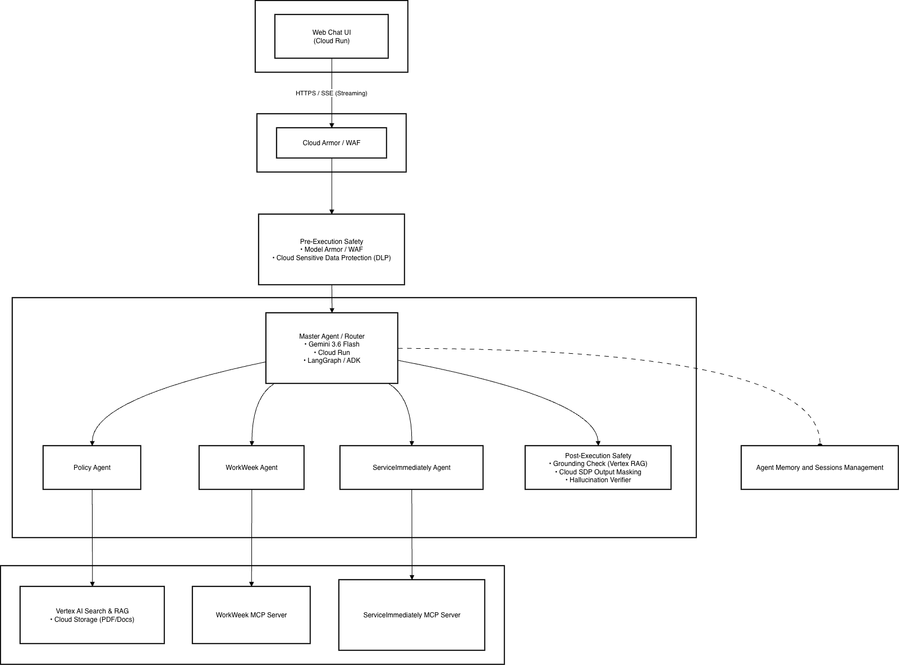
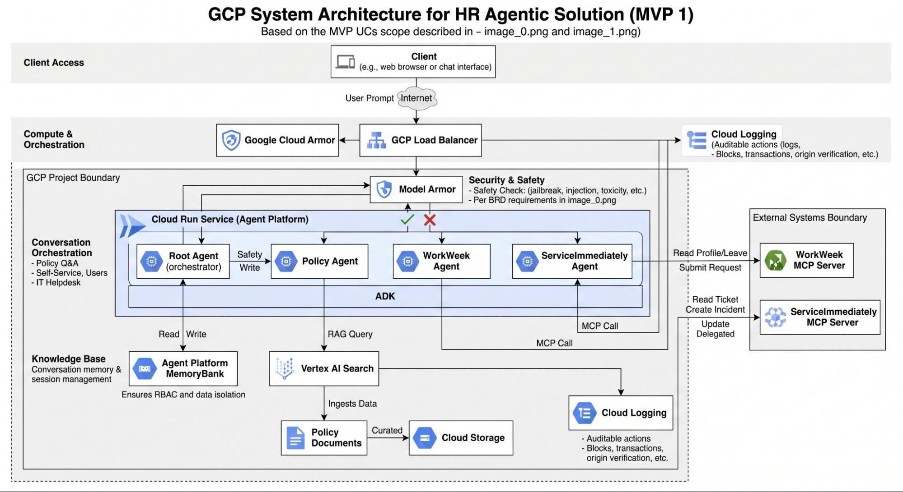
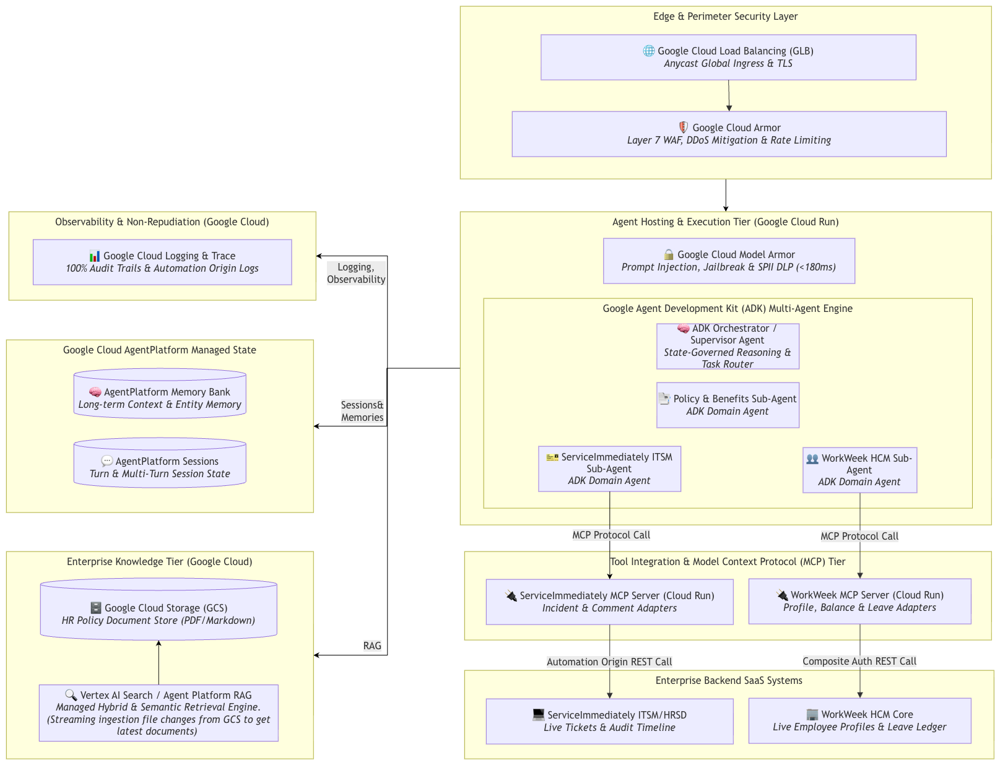
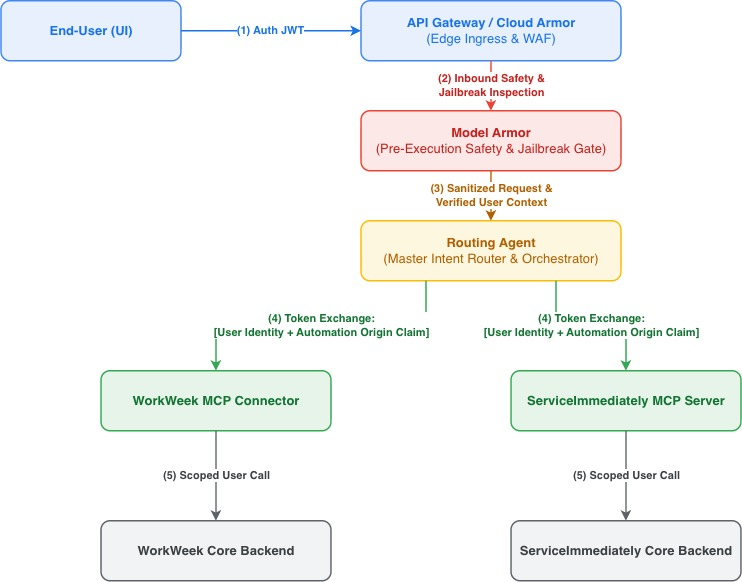
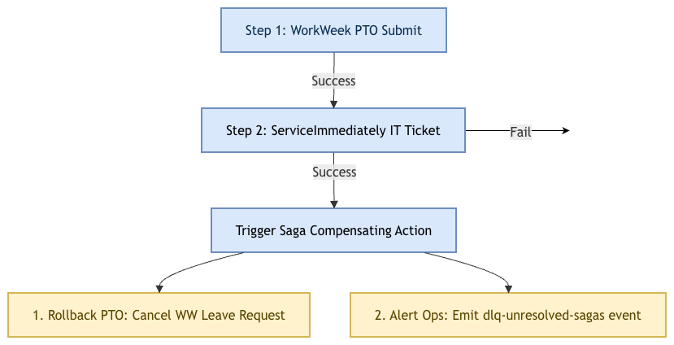
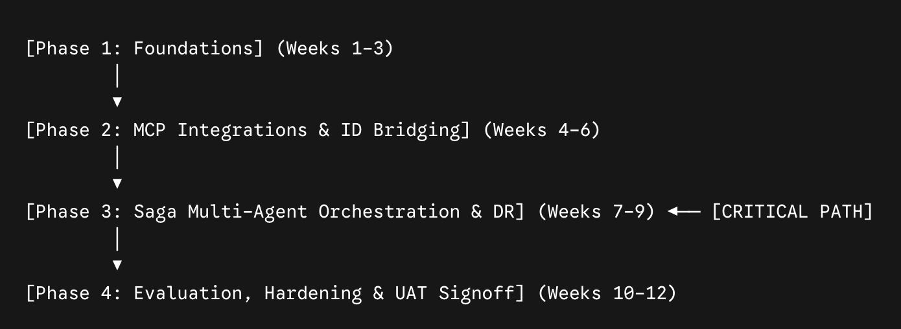

# MVP SOLUTION DESIGN DOCUMENT

# Document Control

## Document Metadata

| **Field** | **Value** |
| --- | --- |
| Author(s) | [Wayne Lin](mailto:waynelinn@google.com), [Wonyou Kim](mailto:wonyou@google.com), [Sirapassorn (Jump) Junpong](mailto:sirapassornjp@google.com), [Ram J A](mailto:ramja@google.com) |
| Date | Aug 25, 2026 |
| Status | Draft |
| Target Audience | Sarah Chen, Alex Rivera |

## Revision History

| **Version** | **Date** | **Author** | **Description of Change** |
| --- | --- | --- | --- |
| 0.1 | Date | Person | Initial outline setup |

# 1. Executive Summary & Scope Boundaries

## 1.1. Business Overview & Context

Current HR and IT helpdesks spend substantial Tier 1 operational capacity addressing repetitive policy inquiries (leave entitlements, benefits, expenses) and performing routine employee self-service transactions (submitting PTO, updating contact details, creating IT support tickets). Employees are currently required to manually navigate multiple fragmented, complex backend UIs (WorkWeek HCM, ServiceImmediately ITSM).

The solution goal is to deliver a secure, conversational AI assistant capable of:

* Grounding answers on static HR policy documents with accurate citations.
* Automating WorkWeek HCM self-service transactions via natural language.
* Orchestrating ServiceImmediately ITSM support incident management through a unified interface.

Success will be measured by a 40% reduction in Tier 1 ticket volume within 6 months, 95% accuracy on policy benchmarks, and 100% transaction correctness.

## 1.2. Scope Boundaries

| **Category** | **In-Scope** | **Out-of-Scope** |
| --- | --- | --- |
| User Interface | Functional web chat client (ADK Web Playground / Web Component) | Voice interface, 3rd-party platforms (Slack, Teams) |
| Knowledge Domain | Curated static HR policy documents (PDF/Markdown) | Unrestricted web search, non-HR enterprise data |
| WorkWeek HCM | Profile/PTO balance reads; contact updates/PTO submissions | Payroll, performance evals, equity management |
| ServiceImmediately | Incident ticket reads; create, comment, update status | Change management, asset tracking, hardware lifecycle |
| System Constraints | Single-tenant, functional mock/test credentials | Multi-tenancy, enterprise SSO/IdP, multi-language |

## 1.3. Target Architecture Overview

### Target Architecture Diagrams

**Figure 1.1: High-Level Solution Architecture**



**Figure 1.2: Vertex AI Search & Policy RAG Ingestion Pipeline**



**Figure 1.3: End-to-End Enterprise Solution Topology**



[🔗 Open Architecture Diagram in diagrams.net](https://app.diagrams.net/#G1bcPlm-NREQQsrgB9wk0Nhss2KHT1Df2j#%7B%22pageId%22%3A%22kHB3jH7Jy12WEhVZlP1O%22%7D)

**Event-Driven Ingestion Pipeline:** Implement an automated Cloud Storage notification trigger via Pub/Sub to a Cloud Run ingestion worker whenever HR policy files (PDF/Markdown) are uploaded, updated, or deleted in the GCS bucket.

**Incremental vs. Batch Sync Cadence:**

* *Event-Driven Delta Ingestion:* Real-time re-indexing on single file updates (propagation window: under 5 minutes).
* *Nightly Scheduled Reconciliation:* Cloud Scheduler job triggering Vertex AI Search re-indexing and document hash verification daily at 02:00 UTC to catch drift or failed delta jobs.

**Document Versioning & Metadata Tagging:** Every ingested chunk must carry schema metadata: effective_date, expiration_date, policy_version, and authoritative_source_url. The Policy Agent's retrieval filter should restrict queries to expiration_date >= CURRENT_DATE.

## 1.4. Alternatives Considered

Compare chosen technical selections against viable alternatives, detailing trade-offs and rationale.

**Table 1: Core Agentic Framework Alternatives**

| **Architecture Option** | **Advantages** | **Disadvantages / Trade-offs** | **Rationale for Selection** |
| --- | --- | --- | --- |
| Selected: Vertex AI Agent Builder + Reasoning Engine | Managed agent state, native grounding, enterprise DLP/Guardrail integration, easy OpenAPI & MCP extension. | Higher initial setup complexity compared to basic chatbot UI. | Selected: Meets NFR-2.1 latency (<10s total, <300ms safety) and FR-1.1 lifecycle governance. |
| Alternative A: Pure LangChain on GKE / Cloud Run | Total code flexibility and custom framework control. | High maintenance overhead, manual memory management, custom guardrail integration. | Rejected: Increases operational burden and slows down time-to-market for MVP 1. |
| Alternative B: Monolithic Dialogflow CX (ES) | Quick intent setup for fixed intent flows. | Struggles with complex cross-system ReAct orchestration and dynamic grounded rag citations. | Rejected: Fails UC-2.x cross-system<br>dynamic reasoning requirements. |

**Table 2: Backend Integration & Tool Connectivity Alternatives**

| **Integration Approach** | **Advantages** | **Disadvantages / Trade-offs** | **Rationale for Selection** |
| --- | --- | --- | --- |
| Selected (Proposed): Standardized Connectors (WorkWeek PC + ServiceImmediately MCP) | Standardized schemas, zero custom middleware for WorkWeek, dynamic capability discovery via MCP, faster development velocity. | MCP is a newer open standard requiring Cloud Run hosting and security configuration. | Selected: Eliminates complex custom OpenAPI middleware code, simplifies agent tool-calling, and improves long-term maintainability. |
| Alternative C: Custom REST Middleware (Apigee + Cloud Run Custom Mock APIs - Pic 1 Architecture) | Complete customization of endpoints, uses traditional REST patterns. | High development overhead, manual schema changes, duplicate code in proxies, slow development velocity. | Rejected: Building and maintaining custom REST proxies and OpenAPI specifications for each backend action introduces high technical debt. |
| Alternative D: Client-Side Orchestration (Web Chat UI handles calls) | No orchestration layer middleware required. | Severe security vulnerability (exposes access credentials), high latency, violates zero-trust backend architecture (FR-1.2). | Rejected: Directly violates security guidelines and enterprise data governance requirements. |

# 2. Production-Ready Future State Design

1. **Enterprise Identity & SSO**: Integration with Okta / Microsoft Entra ID via SAML 2.0 / OIDC for user authentication and dynamic OAuth token delegation.
1. **Multi-Tenancy & Regional Partitioning**: Tenant-isolated knowledge bases by country/entity (e.g., Singapore, US, UK, Korea) and role-specific data separation.
1. **Multilingual Capabilities**: Real-time localization across APAC/global business languages leveraging Gemini’s multilingual processing capabilities.

# 3. System Flows, Sequence Diagrams & Agent Design

Sequence diagram outlining end-to-end data flow. Detail out the agent design and any pre-processing before agent invocation or optimizations for business requirements.

**3.1. End-to-End Data Flow Sequence Diagram**

The sequence diagram below illustrates a complete multi-turn session involving input validation, memory restoration, dynamic sub-agent routing, tool calling via the Model Context Protocol (MCP), grounding check, output masking, and final response streaming.

**3.2. Detailed Agent Design & Orchestration Strategy**

The orchestration layer is structured as a Multi-Agent Supervisor (or Router) System managed by LangGraph on Cloud Run. This design splits cognitive load among specialist agents rather than relying on a single monolithic prompt, ensuring high determinism and meeting the target latency SLAs.

1. Master Agent / Router (Gemini 3.6 Flash)

Role: The centralized orchestrator. It acts as the gatekeeper and traffic controller.

* Engine: Gemini 3.6 Flash provides high-speed token generation and low-latency structured JSON tool output.
* State Machine: Implemented via LangGraph / ADK to model multi-step logical state graphs (e.g., executing Saga pattern transactions for cross-system requests).
* Memory Integration: Externalized to a high-availability Redis cache or Firestore instance to preserve state without storing sensitive data in the AI layer.

2. Sub-Agent Specialized Personas

* Policy Agent (RAG Specialist): Specifically structured to query the Vertex AI Search & RAG engine. It does not perform any write actions. Its prompt is heavily grounded to only answer from the returned search chunks and supply metadata citations.
* WorkWeek Agent (HCM Actions): Interacts exclusively with the WorkWeek MCP Server. It is configured to inspect personal profile information, parse leave balances, and issue chronological vacation/sick leave requests.
* ServiceImmediately Agent (ITSM/HRSD Actions): Interacts with the ServiceImmediately MCP Server. It manages IT tickets, post comments, and updates statuses.

```text
[Step 1: WorkWeek PTO Submit] ──► Success ──► [Step 2: ServiceImmediately IT Ticket] ──► Failed
                                                    │
                                                    ▼
                                      [Trigger Saga Compensating Action]
                                                    │
                                      ├──► 1. Rollback PTO: Cancel WW Leave Request
                                      └──► 2. Alert Ops: Emit dlq-unresolved-sagas event
```

| Multi-Hop Use Case | Step 1 (Primary Action) | Step 2 (Downstream Action) | Step 2 Failure Mode | Compensating Action (Rollback Protocol) |
| --- | --- | --- | --- | --- |
| Equipment & Leave (UC-2.1) | Submit PTO in WorkWeek HCM | Create IT Loaner Ticket in ServiceImmediately | Ticket creation times out or returns HTTP 500 | Execute `cancel_leave_request` in WorkWeek; delete pending leave reservation; log compensation event. |
| Medical Leave (UC-2.2) | Create HRSD Confidential Case | Block Calendar / Submit Sick Leave in WorkWeek | WorkWeek schema validation fails or rejects PTO | Update HRSD Case to `Pending_Employee_Action` with an attached failure note; notify HR case manager. |
| Relocation (UC-2.3) | Update Office Location in WorkWeek | Create Facilities Relocation Ticke | Facilities API unavailable | Revert WorkWeek profile address/location to previous state; log to Dead Letter Queue (DLQ). |

**3.3. Pre-Processing & Input Sanitization (Pre-Execution Safety)**

To safeguard the LLM from prompt injection, malicious overflows, and premature PII exposure, a high-speed pre-processing filter intercepts user queries before reaching the Master Agent:

* Network Layer Filtering (Cloud Armor / WAF): Filters out malicious HTTP headers, volumetric DDoS, and cross-site scripting (XSS) injections.
* Prompt Injection & Jailbreak Prevention (Model Armor): A lightweight, dedicated safety model scans the text to identify semantic attempts to override system instructions.
* PII Reduction (Cloud Sensitive Data Protection / Cloud DLP): Dynamically inspects incoming strings for patterns matching social security numbers, tax IDs, credit cards, or direct passwords, replacing them with standard mask tokens (e.g., [REDACTED_SSN]).

**3.4. Post-Processing & Output Verification (Post-Execution Safety)**

Once the Master Agent generates its response, a deterministic post-processing pipeline executes sequentially to protect sensitive data:

* Grounding Verification (Vertex RAG Grounding Engine): Runs a high-performance check comparing the generated answer against the text retrieved from the policy documents. Responses scoring below a defined confidence threshold are rejected and replaced with a graceful fallback message.
* Output Leakage Masking (Cloud SDP / DLP): Scans the outbound stream to ensure the LLM did not accidentally output unauthorized internal metadata or personal developer stack traces.
* Hallucination Verifier: A heuristic-based rule engine that validates specific numbers, date formats, and transaction IDs (such as INC123456) generated by the LLM against the actual raw tool response data to guarantee absolute precision.

**3.5. Agent Tooling & MCP Schema Mapping**

The following table details how the sub-agents communicate with their respective data stores and MCP backends:

| **Sub-Agent** | **Tool Name** | **Target Integration** | **Primary Input Parameters** | **Safety Guardrail / Validations** |
| --- | --- | --- | --- | --- |
| Policy Agent | search_policies | Vertex AI Search | query_string (string) | Strict grounding confidence threshold check |
| WorkWeek Agent | get_leave_balances | WorkWeek MCP Server | employee_id (string) | Active employee verification |
| WorkWeek Agent | submit_leave_request | WorkWeek MCP Server | employee_id, start_date, end_date, type | Accrual balance check & temporal chronological validation |
| ServiceImmediately Agent | get_ticket_details | ServiceImmediately MCP Server | ticket_id (string) | Format validation (INC + 6 digits) |
| ServiceImmediately Agent | create_incident | ServiceImmediately MCP Server | employee_id, priority, description | Deduplication scan against active requests |

# 4. Security, Governance & Identity

[🔗 Open Security & Identity Diagram in diagrams.net](https://app.diagrams.net/#G18M6hPoXpl-2Gmlg59AVzgDaykviqYGnO#%7B%22pageId%22%3A%22koX6ckM5VCoAgS4Kr6qb%22%7D)

**Figure 3.1: End-to-End Multi-Turn Sequence Diagram**



* **Authentication & Scoping**: Enforce caller-bound delegation tokens to ensure employees can access and modify only their own profile and ticket records.
* **Data Masking & Privacy**: Sensitive PII (national IDs, personal phone numbers) is dynamically redacted from audit logs and conversation history using DLP pattern filters.
* **AI Safety & Policy Guardrails**: Strict grounding guardrails force the model to decline queries when source policy context is insufficient, preventing hallucinations.
* **VPC Service Controls (VPC-SC):** All Vertex AI resources, Cloud Run services, and Cloud Storage buckets are encapsulated within a secure VPC Service Perimeter to prevent unauthorized data exfiltration.
* **Private Service Connect (PSC):** Egress from MCP Server Cloud Run containers to backend HCM/ITSM endpoints flows through managed PSC gateways with strict egress firewall rules.
* **Secret Management:** Backend API keys, test credentials, and service tokens are stored in **Google Cloud Secret Manager**, mounted as secure memory-only environment variables at runtime.

**Figure 4.1: Security, Identity & Context Propagation Topology**



**JWT Claims Extraction:** At the API Gateway / Cloud Run Ingress, decode the verified corporate OIDC JWT claims (sub, email, upn).

**System-Specific Identifier Lookup:** Pass claims to an Identity Translation Service backed by a low-latency Redis/MemoryStore cache (backed by an enterprise Directory Service lookup):

* Map `email` → `WorkWeek.employee_id`
* Map `email` → `ServiceImmediately.sys_id` / `caller_id`

**Secure Tool Ingestion:** Inject translated IDs directly into the authenticated execution context (MCP_meta headers) before invoking sub-agents. The LLM router must never dynamically extract or hallucinate employee IDs from unstructured prompt text.

Session State Schema (Firestore / Redis):

```json
{
  "session_id": "sess_uuidv4",
  "user_id": "WW-10928",
  "created_at": "2026-08-25T10:00:00Z",
  "last_active_at": "2026-08-25T10:04:12Z",
  "status": "ACTIVE",
  "context": {
    "intent_stack": ["UC-2.1_EQUIPMENT_PROCUREMENT"],
    "extracted_entities": {
      "start_date": "2026-09-01",
      "end_date": "2026-09-05"
    },
    "saga_state": {
      "step_1_complete": true,
      "step_2_complete": false,
      "tx_id": "TX-9921"
    }
  },
  "ttl": 86400
}
```

Audit Trail Schema (BigQuery Sink via Cloud Logging):

```json
{
  "audit_event_id": "evt_uuidv4",
  "timestamp": "2026-08-25T10:02:15.342Z",
  "authenticated_user_id": "WW-10928",
  "action_type": "TOOL_EXECUTION",
  "sub_agent": "WorkWeek_Agent",
  "tool_called": "submit_leave_request",
  "input_parameters_redacted": {
    "days": 4,
    "type": "PTO"
  },
  "execution_status": "SUCCESS",
  "latency_ms": 1420,
  "dlp_redaction_applied": true
}
```

**Data Lifecycle & Retention Rules:**

* *Session Memory:* Retained in Redis/Firestore with an explicit TTL of 24 hours from last turn; hard deleted post-expiration.
* *Audit & Security Logs:* Streamed to Cloud Logging and archived to BigQuery with a 90-day active retention policy, moving to long-term cold storage (GCS Archive) for 365 days before permanent purge.

# 5. Integration Details & Error Handling

Detailed methodology for 3rd party tool integration.

Map potential system component failures to custom fallback logic and user notifications.

| **Integration Boundary** | **Source Component** | **Target Component** | **Protocol / Transport** |
| --- | --- | --- | --- |
| **Presentation Gateway** | Web Chat UI | Cloud Run Gateway | HTTPS / WAF (Cloud Armor) |
| **Security Middleware** | Cloud Run Gateway | Vertex AI Model Armor & Cloud DLP | Google Cloud gRPC / Internal SDK |
| **Agent Orchestration** | Supervisor Router Agent | Specialized Sub-Agents | In-Memory Graph (LangGraph on Vertex AI Reasoning Engine) |
| **HCM Integration** | WorkWeek Specialist Agent | WorkWeek MCP Server | MCP JSON-RPC 2.0 over HTTP/SSE |
| **ITSM Integration** | ServiceImmediately Specialist Agent | ServiceImmediately MCP Server | MCP JSON-RPC 2.0 over HTTP/SSE |
| **Policy Search** | Policy Specialist Agent | Vertex AI Search Datastore | Cloud Search Client SDK |

Component Failure Modes, Fallback Logic & User Notifications

| **Component / Layer** | **Potential Failure Scenario** | **Detection & Handling Strategy** | **Custom Fallback Logic** | **User-Facing Notification** |
| --- | --- | --- | --- | --- |
| **Security Guardrail (Model Armor)** | Malicious prompt injection, jailbreak attempt, or toxic language detected | Pre-LLM inspection returns a high-risk policy violation flag within <150ms | Request execution is halted immediately; the incident is logged with risk severity in Cloud Logging | *"I cannot process this request as it violates company AI safety policies. Please rephrase your question regarding HR policies or self-service."* |
| **Knowledge Engine (Vertex AI Search)** | Insufficient document context, unindexed policy, or grounding score < 0.85 | Vertex AI Grounding evaluation fails confidence threshold; zero supporting citations returned | Suppress LLM generation to prevent hallucinations | *"I could not find an answer to this in our approved HR policy documents. Please contact the HR Direct support desk for further assistance."* |
| **WorkWeek MCP Server** | MCP server timeout (>4.0s), network disruption, or backend unreachable | Client-side timeout triggers exponential backoff (3 retries at 500ms, 1.5s, 3.0s); circuit breaker opens on continuous failure | Terminate connection gracefully without surfacing backend stack traces | *"WorkWeek services are temporarily unreachable. Your request could not be processed at this moment. Please try again in a few minutes."* |
| **WorkWeek Business Logic** | Leave balance exceeded or invalid date chronology (e.g., end date before start date) | Sub-agent pre-validation catches business constraint violations prior to or upon MCP response | Reject transaction mutation and prompt user for parameter correction | *"You requested 24 hours of PTO, but your available balance is 16 hours. Would you like to submit a request for 16 hours instead?"* |
| **ServiceImmediately MCP Server** | Invalid lifecycle transition (e.g., 'New' to 'Closed') or duplicate ticket submission | MCP tool response returns error code mapping to lifecycle validation rules | Abort invalid update and fetch current ticket status timeline | *"Ticket INC008912 is currently in 'In Progress' status and cannot be closed directly without resolution notes. Would you like to add an update comment instead?"* |
| **Cross-System Multi-Hop (Saga Orchestration)** | Step 1 succeeds (WorkWeek PTO submitted), but Step 2 fails (ServiceImmediately ticket creation fails) | Supervisor agent detects downstream step failure in the execution graph | Log transaction ID in audit store with flag REQUIRES_MANUAL_RECONCILIATION; generate alert for operations team | *"Your leave request has been confirmed in WorkWeek (#WW-98721); however, automated notification setup encountered an issue. HR Operations has been notified to complete the remaining setup."* |
| **Cloud DLP Redaction** | DLP inspection service latency spike or temporary inspection failure | Asynchronous queue fallback; logs are staged in a secure ephemeral buffer until inspection resumes | Fail-secure default (retain masked views for standard operational logs) | No user interruption; conversation proceeds without degradation |

Concurrency Handling, Rate Limiting & Throttling:

| Layer / Service | Rate Limiting / Quota Strategy | Concurrency / Auto-Scaling Config | Backpressure & Fallback Behavior |
| --- | --- | --- | --- |
| API Gateway / Cloud Armor | Token bucket: 60 req/min per IP, 30 req/min per user ID | Cloud Run ingress auto-scaling to max 200 container instances | HTTP 429 (Too Many Requests) with `Retry-After` header |
| Model Armor & DLP | Regional quota limits aligned with Vertex AI project quotas | Cloud DLP asynchronous job queue pooling during burst traffic | egraded non-blocking mode with standard regex safety masks |
| WorkWeek MCP Server | 50 concurrent tool executions; max 25 calls/sec per service account | Cloud Run min instances set to 5 during open enrollment; max 50 instances | Circuit Breaker trips after 5 consecutive 503s; queue requests in Redis with push notification |
| ServiceImmediately MCP | 40 concurrent REST calls; adaptive throttling on downstream HTTP 429 | Cloud Run horizontal scaling with target CPU utilization at 60% | Failover to asynchronous incident ingestion queue |

Human Warm-Handoff Protocol & Operational Fallbacks:

**Trigger Conditions:**

* 3 consecutive tool/backend timeouts (≥ 15s).
* 2 consecutive user clarifications failing validation (e.g., negative leave balances, contradictory dates).
* High-risk prompt sentiment or explicit user request ("agent", "human", "representative").

**Execution Workflow:**

1. **Session Summary Generation:** Supervisor agent compiles a JSON payload: conversation history, user identity, intent context, and root failure cause.
1. **Automated Ticket Dispatch:** Call ServiceImmediately MCP to generate a high-priority incident ticket (category: "AI Service Escalation").
1. **Live UI Escalation:** Return a warm-handoff card in the web chat UI providing the ticket reference ID, expected response SLA (e.g., < 15 mins), and a one-click redirect to live HR/IT chat support.

# 6. Cost Estimation & FinOps

* **LLM Inference:** Gemini 1.5 Flash (Triage, Input/Output screening) + Gemini 1.5 Pro (Planning, Synthesis).
* **Knowledge Retrieval:** Vertex AI Search query volumes and document indexing storage.
* **Serverless Compute:** Cloud Run vCPU and memory allocation for Supervisor Orchestrator and MCP Servers.
* **Security & Governance:** Vertex AI Model Armor inspection calls + Cloud Sensitive Data Protection (DLP) data scan volume.

# 7. Deployment & Delivery Plan

**Figure 7.1: MVP Delivery Roadmap & Milestone Timeline**



| Phase | Duration | Required Engineering Resources | Key Deliverables | Critical Path Dependencies |
| --- | --- | --- | --- | --- |
| Phase 1: Core Infra & RAG | Weeks 1–3 | 1 GCP Cloud Architect, 1 ML Engineer | Terraform scripts, GCS sync pipelines, Vertex AI Search RAG setup, Model Armor baseline. | GCP Project perimeters, IAM Service Accounts. |
| Phase 2: MCP & Identity | Weeks 4–6 | 2 Backend Engineers, 1 Security Engineer | WorkWeek & ServiceImmediately MCP servers, JWT-to-Backend ID bridging, Rate-limiting on Cloud Run. | Mock backend test endpoints, Okta/OIDC test scopes. |
| Phase 3: Saga & Fallbacks | Weeks 7–9 | 1 AI Orchestration Lead, 1 Backend Engineer | LangGraph supervisor agent, Saga rollback transactions, Warm handoff & DLQ routing, BigQuery audit sinks. | Critical Path: MCP servers and identity mapping completion. |
| Phase 4: Hardening & UAT | Weeks 10–12 | 1 QA / Red Team Lead, 1 HR Business Analyst | Red-teaming benchmark runs, Concurrency & load testing, UAT sign-off, Production release runbook. | Golden Dataset curation and complete agentic pipeline. |

# 8. Assumptions, Constraints, Risk & Mitigations

### 1. Critical Technical & Operational Assumptions

* **Authentication Framework:** The MVP will utilize functional test credentials for backend integrations, and full integration with enterprise identity management systems (e.g., Active Directory, Okta, SSO) is excluded for this initial phase.
* **Deployment Environment:** The initial implementation targets a strictly single-tenant environment; multi-tenancy support is not required or supported for MVP 1.
* **Document Synchronization:** Updates made to the source policy repository will be automatically reflected in the AI Knowledge Base within a defined synchronization window to ensure accurate answers.

### 2. Implementation Constraints

* **Integration Scope:** The system is strictly limited to interacting with three domains: WorkWeek (HCM), ServiceImmediately (ITSM), and the designated static Policy Repository
* **Data Boundaries:** Processing of payroll data, performance reviews, or compensation details is explicitly out of scope for MVP 1.
* **Interaction Modalities:** The solution will only support text-based conversational interfaces; voice-based interactions and multi-lingual capabilities are excluded.
* **Performance Overhead:** The addition of input and output safety scanning must not introduce more than 300ms of latency per conversational turn.

| Risk ID | Risk Category | Risk Description | Severity / Likelihood | Mitigation Strategy | Owner |
| --- | --- | --- | --- | --- | --- |
| RSK-01 | Technical | Stale HR policy search index outputs outdated policy rules. | High / Medium | Implement Pub/Sub automated ingestion triggers on GCS bucket updates + nightly full index reconciliation. | ML Engineer |
| RSK-02 | Security | Identity spoofing via client-modified identity claims. | Critical / Low | Strict cryptographic signature validation on JWTs at API Gateway; inject identity headers into MCP calls downstream. | Security Lead |
| RSK-03 | Operational | MCP backend saturation or rate-limit lockouts during peak open enrollment. | High / High | Apply Cloud Armor ingress throttling; configure Cloud Run auto-scaling with min instances; implement circuit breakers. | Cloud Architect |
| RSK-04 | Data Integrity | Partial Saga execution leaves WorkWeek and ServiceImmediately in desynchronized states. | High / Medium | ADK state graph monitors execution; triggers automated compensating rollback functions on downstream failure. | AI Lead |
| RSK-05 | Compliance | PII/SPII leakage through audit logs or prompt outputs. | High / Low | Dual-stage Cloud DLP masking on both pre-execution ingress and post-execution outbound stream before BigQuery logging. | Data Governance |

# 9. Quality Evaluation & UAT Framework

### 1. Quantitative Performance Metrics

The evaluation of the system is categorized across five core operational dimensions:

* **Task & Information Accuracy:**

* **Q&A Accuracy Rate:** The percentage of policy questions answered correctly based exclusively on the approved document corpus. Target: $\ge$ 95%.
* **Hallucination Rate:** The frequency of generated facts or policies not present in the ingested Knowledge Base. Target: 0%.

* **Execution & Transaction Integrity:**

* **Transaction Correctness:** The rate of successful execution for backend system updates (e.g., leave submission, ticket creation) without data corruption or unauthorized updates. Target: 100%.
* **Cross-System Orchestration Success:** The pass rate of complex, multi-domain workflows spanning Policies, WorkWeek, and ServiceImmediately. Target: 100% Pass.

* **Security & Guardrail Efficacy:**

* **Adversarial Detection Rate:** The ability to intercept and block known prompt injection and jailbreak attempts. Target: 100% Detection.
* **False Positive Rate:** The frequency at which legitimate employee queries are incorrectly blocked by safety scanners. Target: < 1%.
* **Audit Coverage:** The percentage of API interactions and safety blocks that are accurately logged with origin indicators. Target: 100%.

* **Latency & Throughput:**

* **Response Latency:** The average time taken from user input to the beginning of response generation. Target: < 10.0 Seconds.
* **Safety Overhead:** The latency introduced per conversational turn by input/output validation checks. Target: < 300ms.

* **System Resilience:**

* **Availability:** The guaranteed system uptime aligned with standard enterprise SaaS SLAs. Target: 99.9%.
* **Graceful Degradation:** The system's ability to handle simulated downtime of integrated services without leaking technical errors. Target: 100% Graceful failure.

### 2. Evaluation Dataset Curation Strategy

To rigorously evaluate the MVP against these metrics, the QA and HR teams must curate a "Golden Dataset" representing a diverse distribution of realistic interactions, edge cases, and adversarial attacks. The dataset should be stratified into the following categories:

* **Policy Retrieval (RAG) Benchmark Set:**

* *Positive Examples:* Standard queries regarding core HR domains such as Leave Policies, Expense Guidelines, Remote Work Policy, and Code of Conduct.
* *Negative/Boundary Examples:* Ambiguous queries, unanswerable queries (where the policy doesn't exist), and out-of-domain queries (e.g., general coding questions) to validate the "Domain Containment" guardrail.

* **Single-Domain Transactional Set:**

* *WorkWeek (HCM):* Variations of prompts checking PTO balances and requesting time off. Includes boundary tests such as requesting leave that exceeds the accrued balance or dates with temporal invalidity (e.g., end date before start date).
* *ServiceImmediately (ITSM):* Variations of prompts for checking ticket statuses, adding comments, and creating incidents across different priority levels. Includes edge cases like invalid status transitions (e.g., New directly to Closed).

* **Cross-System Orchestration (Saga) Set:**

* Complex, multi-intent prompts mirroring the core MVP use cases: Equipment Procurement (UC-2.1), Medical Leave (UC-2.2), and Relocation (UC-2.3).

* **Adversarial & Safety (Red Team) Set:**

* A robust catalog of prompt injection attacks, jailbreak attempts, attempts to extract sensitive or cross-user data, and toxic language inputs designed to stress-test the pre- and post-execution safety layers.

### 3. Acceptance Thresholds Matrix

The following matrix defines the strict Pass/Fail criteria that the MVP prototype must satisfy during User Acceptance Testing (UAT) before it can be considered for large-scale rollout.

| **Evaluation Category** | **Success Metric / Criterion** | **Acceptance Threshold** | **Evaluation Method** |
| --- | --- | --- | --- |
| **Policy Q&A Accuracy** | Precision and recall of answers derived from policy documents. | $\ge$ 95% Accuracy; 0% Hallucination. | Automated RAG evaluation (Vertex AI Evaluation) against the Golden Dataset. |
| **Transaction Integrity** | Execution of self-service actions in backend systems. | 100% Transaction Correctness. | Automated API assertion testing against WorkWeek/ServiceImmediately mock endpoints. |
| **Cross-System Orchestration** | Chaining actions across Policies, WorkWeek, and ServiceImmediately. | Pass on all defined Cross-System Use Cases (UC-2.x). | End-to-end integration testing via UI simulation. |
| **Safety & Guardrail Efficacy** | Blocking malicious, unsafe, or off-topic prompts. | 100% Detection of prompt injections; < 1% False Positives. | Red Team execution using the Adversarial Dataset. |
| **Response Latency** | Time taken to begin generating a response. | < 10.0 Seconds average; Safety scanning overhead < 300ms. | Load testing and Cloud Trace analysis. |
| **Auditability & Traceability** | Logging of all allowed and blocked actions with origin indicators. | 100% Log Coverage. | Verification of BigQuery log sinks and Cloud Logging traces. |
| **Resilience & Error Handling** | System behavior during simulated downtime of integrated systems. | 100% Graceful degradation; clear fallback instructions. | Chaos engineering (simulating HTTP 500s/Timeouts on downstream endpoints). |
| **Business Impact (Post-Launch)** | Reduction in routine HR and IT helpdesk ticket volume. | $\ge$ 40% reduction within the first six months. | Analytics tracking and ServiceImmediately volume reporting. |

# 10. Assumptions / Open Questions

| **Category** | **Assumption & Constraint Description** | **BRD Reference** | **Architecture Impact** |
| --- | --- | --- | --- |
| **System Integration** | WorkWeek and ServiceImmediately are accessed strictly via containerized MCP servers; direct REST/SOAP API access is not provided. | Sec 2.1, 2.3 | Encapsulates all transport logic, schemas, and credentials within MCP servers. |
| **Policy Ingestion** | Curated HR policy documents are authoritative, approved, in static PDF/text format, and stored in Cloud Storage. | Sec 2.2, FR-5.1 | Enables Vertex AI Search layout-aware chunking and strict semantic grounding. |
| **Authentication & IAM** | MVP 1 operates on functional test credentials; live enterprise IdP integration (SSO, Active Directory, Okta) is deferred. | Sec 6 | Simplified authentication layer; identity context passed via MCP _meta headers. |
| **Tenancy & Channels** | Single-tenant deployment supporting English-only, text-based web chat; voice and multi-language support are excluded. | Sec 2.3, Sec 6 | Single-tenant Cloud Run deployment with text-based Gemini 1.5 Pro/Flash orchestration. |
| **Data Caching** | Employee profiles and PTO balances are fetched live on every query; no employee dynamic data is cached in the orchestrator. | FR-3.4 | Ephemeral session memory only; zero persistent caching of PII in Redis layer. |
| **Data Exclusions** | Payroll, compensation details, and employee performance reviews are strictly out of scope. | Sec 2.3 | Excluded from Vertex AI Search index, agent system prompts, and MCP tool schemas. |
