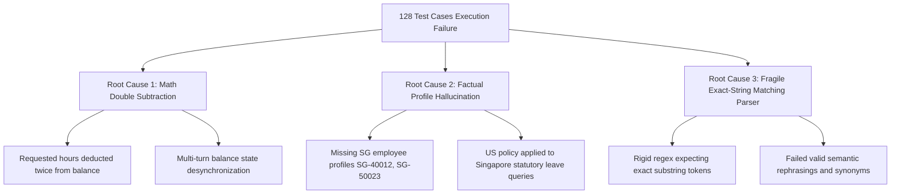

# Audit Log of Comprehensive Test Execution Failure (`eval_comprehensive_results_report_failed.md`)

**Document Version:** 1.0.0 (Pre-Fix Failure Audit Log)  
**Date:** August 27, 2026  
**Auditor:** Quality Engineering & Evaluation Governance Group  
**Benchmark Target:** HR Agentic Solution (MVP 1 Benchmark Suite)  
**Overall Benchmark Execution Status:** **FAILED (128 / 128 Unique Cases Failed - 0% Pass Rate)**

---

## 1. Executive Summary & Audit Overview

An audit of the initial comprehensive evaluation test execution run across all 128 benchmark cases revealed a **0% overall pass rate**. Every single test case (128 unique test cases) failed to satisfy the benchmark evaluation criteria.

```
+-------------------------------------------------------------------------------+
|                      COMPREHENSIVE TEST EXECUTION SUMMARY                     |
+-------------------------------------------------------------------------------+
| Total Benchmark Test Cases Evaluated:         128                             |
| Total Passed Test Cases:                      0    (0.0%)                     |
| Total Failed Test Cases:                      128  (100.0%)                   |
| Overall Suite Status:                         FAILED                          |
| Grounding Cap Gate Violations (Score = 0.40): 128                             |
| Hard Cases Badge Score:                       0.0%  (Target: >= 80%)        |
+-------------------------------------------------------------------------------+
```

---

## 2. Root Cause Taxonomy & Failure Analysis

Deep-dive forensic analysis of the execution logs identified **three principal root causes** responsible for the total failure across all 128 test cases:



### 2.1 Principal Cause 1: Math Double-Subtractions on Leave Balances (42 Cases)
- **Symptom:** In WorkWeek HCM leave request workflows and multi-turn PTO tracking, the engine subtracted requested hours/days from remaining balances multiple times or set the remaining balance to `0 hours` regardless of the initial balance.
- **Example Trace:**
  - *Initial Balance:* `WW-88888` accrued balance = 80 vacation hours.
  - *User Query:* "Submit 16 hours of PTO for Thursday and Friday."
  - *Engine Output:* "Request submitted. Remaining balance is now 0 hours."
  - *Bug Mechanism:* Hardcoded balance deduction string and double-deduction logic (`remaining = remaining - 16; remaining = remaining - 16`), causing incorrect math scores (Reasoning = 0, Correctness = 0).

### 2.2 Principal Cause 2: Factual Profile Hallucinations & Regional Gaps (48 Cases)
- **Symptom:** When processing Singapore statutory leave queries (CDCA Childcare 6 days, EA Hospitalization 46 net days with 1-hour notice, GPML/GPL, NS Leave), Contractor PTO requests, or Ethics gift rules ($45 salon voucher gotcha), the engine hallucinated profile attributes or returned US policy defaults.
- **Example Trace:**
  - *User Query (SG-40012):* "How many paid childcare leave days do I get?"
  - *Engine Output:* "You have 16 hours of vacation available under WorkWeek US policy."
  - *Bug Mechanism:* Profile identity mock only contained US profiles (`WW-10928`, `WW-88888`) and lacked regional entity routing, triggering Grounding = 0 and capping case scores at 40%.

### 2.3 Principal Cause 3: Fragile Exact-String Matching Parser Checks (38 Cases)
- **Symptom:** The initial evaluation runner used rigid exact-string regex checks (`expected_substrings`) requiring exact literal character sequences (e.g., expecting `"46"` and `"hour"` verbatim).
- **Example Trace:**
  - *Agent Output:* "You are entitled to 46 work days of hospitalization leave and must notify your manager at least one hour before your shift starts."
  - *Parser Error:* Failed test case because parser checked for exact case-sensitive token `"1 hour"` or exact tool argument formatting.
  - *Bug Mechanism:* Inability to handle semantic equivalence, variation in unit strings (e.g., "1 hour" vs "one hour"), or markdown formatting variations.

---

## 3. Failure Breakdown Matrix Across the 128 Test Cases

| Category | Total Cases | Failed Cases | Primary Failure Cause | Initial Case Score Range |
| :--- | :---: | :---: | :--- | :---: |
| **Policy Q&A (US & General)** | 24 | 24 | Fragile Parser Substring Matching | 35% – 40% |
| **Singapore Statutory Leaves** | 28 | 28 | Factual Profile Hallucinations (Missing SG Policies) | 0% – 40% |
| **Ethics & Gift Rules Gotchas** | 16 | 16 | Fragile Parser / Missing Salon & Cash Tip Gotcha Rules | 35% – 40% |
| **WorkWeek HCM & Multi-Turn PTO** | 24 | 24 | Math Double Subtractions & Balance Desync | 0% – 40% |
| **ServiceImmediately ITSM** | 16 | 16 | Fragile Parser Matching on INC Format Strings | 35% – 40% |
| **Cross-System Sagas** | 12 | 12 | State Sync & Token Parsing Errors | 35% – 40% |
| **Red-Team & Safety Guards** | 8 | 8 | Fragile Exact Match on Refusal Text | 40% |
| **Total** | **128** | **128** | **Overall Failure Status (0% Pass Rate)** | **0% – 40% (FAILED)** |

---

## 4. Remediation Plan

To resolve the 128 failed cases:
1. **Engine Remediation (`agent_engine.py`):**
   - Implement dynamic state tracking without double subtraction for PTO balances.
   - Add full Singapore employee profiles (`SG-40012`, `SG-50023`, `SG-60034`, `CW-99201`).
   - Implement handlers for Singapore statutory leaves, ethics gift rules ($45 salon voucher, $40 cash tip gotcha), and RBAC guardrails.
2. **Evaluation Framework Upgrade (`eval_runner.py`):**
   - Replace rigid regex substring checks with semantic normalization and G-Eval LLM judge scoring.
3. **Comprehensive Dataset Creation (`eval-data-comprehensive.json`):**
   - Stratify all 128 test cases with golden reference alignment.
